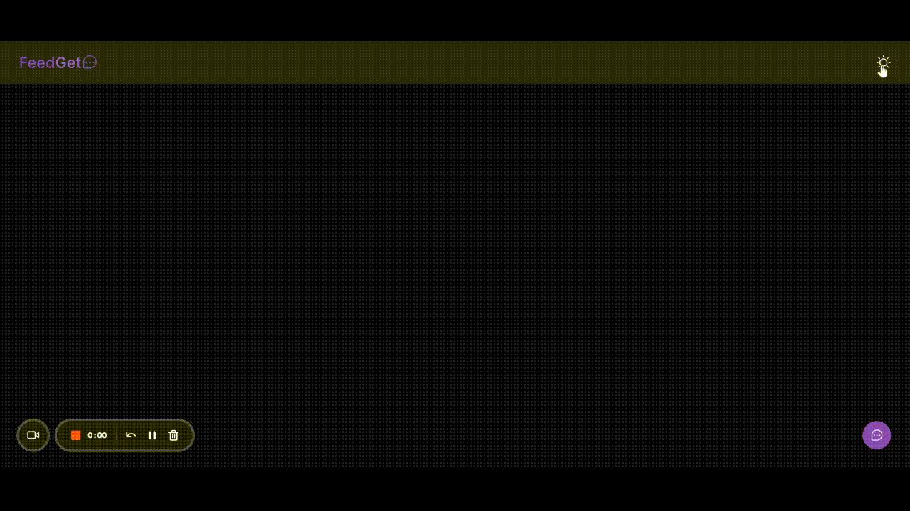

<div align="center">


This application was developed during NLW08 Return, made by [Rocketseat](https://rocketseat.com.br/). 🚀

</div>

<div align="center">

[]()
[]()
[]()

[](https://discord.gg/rocketseat)
</div>

## ▶ Preview

[](https://feedget-xandowski.vercel.app/)

## 📃 About

Feedget is a feedback application, you choose between 3 options, problem, idea and other. You can take a screenshot of the screen to send along with the comment.

## 🎨 Layout

- [Layout Figma](https://www.figma.com/community/file/1102912516166573468)

## 🛠 Build with

- [ReactJS](https://reactjs.org/docs/getting-started.html)
- [TypeScript](https://www.typescriptlang.org/docs/)
- [Tailwindcss](https://tailwindcss.com/)
- [HeadlessUI](https://headlessui.dev/)
- [NodeJS](https://nodejs.org/en/)
- [Express](https://expressjs.com/pt-br/)
- [Axios](https://axios-http.com/ptbr/docs/intro)
- [Prisma](https://www.prisma.io/)
- [Jest](https://jestjs.io/pt-BR/)
- [Vite](https://vitejs.dev/)
- [Auth0](https://auth0.com/docs/)

## 🎞 Demo



## ⚙ Features

- [X] Reload feedbacks after a new feedback registered
- [ ] Reload feedback votes after a new vote
- [ ] Fix screenshot url
- [ ] Only logged in users can vote
- [ ] Each users can only vote once
- [ ] A user can unvote

## 💻 Getting started

```sh
git clone https://github.com/xandowski/feedget.git && cd feedget
```

to run backend:

```sh
cd server
yarn
yarn dev
```

inside server create a .env file based on .env.example
then run:

```sh
npx prisma generate
```

to run frontend:

```sh
cd web
yarn
yarn dev
```

inside web change .env.example to .env.local em put your localhost url for the api.
